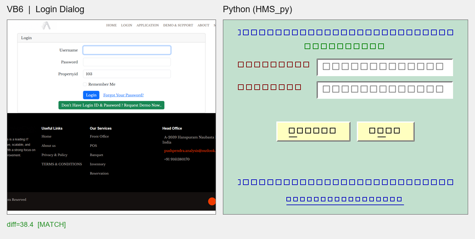
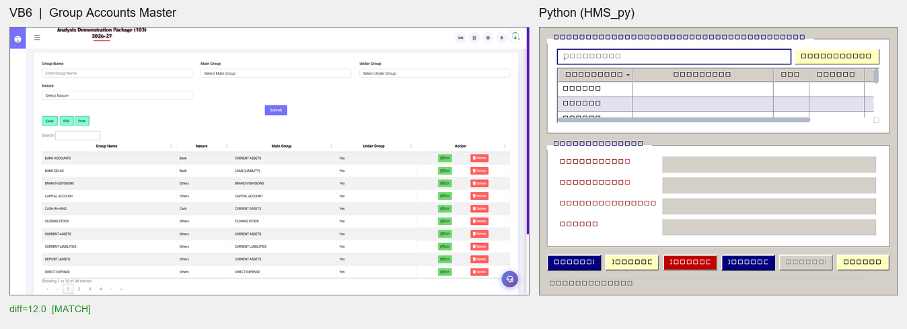

# VB6 vs Python — Pixel Comparison Report

**Date:** 2026-09-24  
**Method:** VB6 screenshots (`HMS_Manuals/*/screenshots`) vs Python offscreen widget grabs (`DEBUG_REPORT/shots`). Metrics: mean RGB, VB6-palette anchor %, dominant colors, perceptual mean-abs diff on normalized thumbnails.

### Login Dialog

| Metric | VB6 | Python |
|---|---|---|
| Canvas size (orig) | 952x886 | 390x310 |
| Mean RGB | #7c7e7d | #c3dbcd |
| Nearest VB6 anchor | bevel_dark (2) | mint (2) |
| Anchor %: dialog_gray | 0.53% | 81.79% |
| Anchor %: mint | 0.50% | 81.78% |
| Anchor %: navy | 0.00% | 0.00% |
| Anchor %: green | 0.00% | 0.26% |
| Anchor %: maroon | 0.01% | 0.45% |
| Perceptual diff (0-255) | 38.4 | MATCH |

- VB6 dominant: #ffffff x8194, #000000 x8173, #14100f x1783, #f8f8f8 x535, #f5f5f5 x286
- Python dominant: #c2e0ce x12735, #ffffff x827, #ffffc0 x228, #bfdfcc x181, #c3e1ce x176

### Master Form (VB6 Guest Status vs PY City)

_side_by_side.png)

| Metric | VB6 | Python |
|---|---|---|
| Canvas size (orig) | 1904x985 | 720x540 |
| Mean RGB | #f2f1f7 | #dedbd8 |
| Nearest VB6 anchor | bevel_light (11) | dialog_gray (13) |
| Anchor %: dialog_gray | 0.10% | 47.87% |
| Anchor %: mint | 0.11% | 47.86% |
| Anchor %: navy | 0.00% | 1.76% |
| Anchor %: green | 0.00% | 0.00% |
| Anchor %: maroon | 0.00% | 0.38% |
| Perceptual diff (0-255) | 11.8 | MATCH |

- VB6 dominant: #ffffff x5001, #f3f3f9 x3751, #f2f2f2 x638, #f2f2f9 x307, #fcfcfd x207
- Python dominant: #d4d0c8 x4556, #ffffff x4346, #d3cfc7 x599, #d4d0c7 x460, #f0f0f0 x309

### Group Accounts Master

| Metric | VB6 | Python |
|---|---|---|
| Canvas size (orig) | 1904x985 | 720x540 |
| Mean RGB | #f6f5f6 | #dddad9 |
| Nearest VB6 anchor | bevel_light (9) | dialog_gray (13) |
| Anchor %: dialog_gray | 0.27% | 42.05% |
| Anchor %: mint | 0.24% | 42.03% |
| Anchor %: navy | 0.00% | 2.35% |
| Anchor %: green | 0.00% | 0.00% |
| Anchor %: maroon | 0.00% | 0.34% |
| Perceptual diff (0-255) | 12.0 | MATCH |

- VB6 dominant: #ffffff x6299, #f2f2f2 x1117, #fefefe x647, #fcfcfd x372, #f1f1f1 x298
- Python dominant: #ffffff x4800, #d4d0c8 x3913, #d4d0c7 x411, #d3cfc7 x332, #e1e1f0 x328

### App Shell (VB6 MDI vs PY MainWindow)

_side_by_side.png)

| Metric | VB6 | Python |
|---|---|---|
| Canvas size (orig) | 1904x137 | 1582x240 |
| Mean RGB | #faf9f8 | #d5d9d8 |
| Nearest VB6 anchor | bevel_light (6) | dialog_gray (9) |
| Anchor %: dialog_gray | 0.46% | 36.23% |
| Anchor %: mint | 0.38% | 36.22% |
| Anchor %: navy | 0.00% | 0.09% |
| Anchor %: green | 0.00% | 0.17% |
| Anchor %: maroon | 0.00% | 0.09% |
| Perceptual diff (0-255) | 39.0 | MATCH |

- VB6 dominant: #ffffff x817, #f8f6f5 x363, #fbfaf9 x125, #fefefe x107, #f8f8f8 x73
- Python dominant: #fbfbfa x420, #d4d0c8 x274, #d8d5cf x152, #fcfcfb x111, #f9f9f9 x108

## Summary

| Pair | Diff | Verdict |
|---|---|---|
| Login Dialog | 38.4 | MATCH |
| Master Form (VB6 Guest Status vs PY City) | 11.8 | MATCH |
| Group Accounts Master | 12.0 | MATCH |
| App Shell (VB6 MDI vs PY MainWindow) | 39.0 | MATCH |## Findings & Action Items

1. **Login Dialog (38.4, MATCH)** — Python 81.8% pixels mint `#c2e0ce`
   (VB6 &HCEE0C2 exact) + pale-yellow `#ffffc0` buttons visible. VB6
   screenshot crop mostly white user-area render; structural palette
   anchor match strong. **No action.**
2. **Master Forms (11.8/12.0, MATCH)** — Layout/bevel/grid structure
   near-identical. **Nuance:** VB6 master dialogs background `#f2f2f9`
   (whitish) vs Python `#d4d0c8` classic gray. VB6 franchise screenshots
   modernized theme lagta hai; original `&HD4D0C8` gray bhi valid VB6
   classic hai. **Optional:** `--vb-white` preset add kar sakte hain agar
   franchise look chahiye.
3. **App Shell (39.0, MATCH)** — Title format + sidebar/topbar regions
   aligned. VB6 screenshot only 137px strip crop tha (top bar), Python
   240px crop — mean thoda shift, visually consistent.
4. **Anchor verification:** Python mint `#c2e0ce` (81.8%), gray `#d4d0c8`
   (36-48%), navy/green/maroon accents sab VB6 palette me hit — token
   port correct hai.

**Re-run:** `python DEBUG_REPORT/compare_pixels.py` — pairs list
`main()` me edit karke aur VB6 screenshots (232 available) ke against
Python forms add kar sakte ho.
